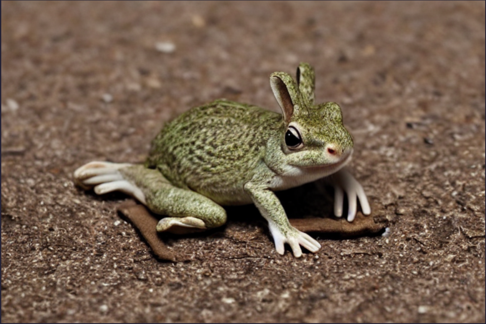

# _Stable Diffusion_

<iframe width="560" height="315" src="https://www.youtube.com/embed/-lz30by8-sU" title="YouTube video player" frameborder="0" allow="accelerometer; autoplay; clipboard-write; encrypted-media; gyroscope; picture-in-picture" allowfullscreen></iframe>

[Code](https://colab.research.google.com/drive/1NYiHllO98gp-gnM7JMenyGQ6S94cz8z2?usp=sharing)

Learning stable diffusion following the tutorial from Computerphile.

The original code is buggy, it took me a while to make the program working.

Stable diffusion can outperform GAN because it is easy to train, and with language models, we can achieve even more. Diffusion model opens an era for AIGC (AI Generated Content), and brought about the exponential growth of Novel AI, Midjourney, Meitu Ai, etc. 

The original picture belongs to [Tida's Gallery](https://tida.gallery/). Wonderful artworks.

The diffusion process can be similar to removing the noise from an noised image.

So we embed the text and use the text embeddings to modify pixels from any noised state, then we can achieve img to img guidance.

_**"A blind-folded women in white embraced by another women holding a rose wearing in black, red background, Rococo, Detailed, Digital Art"**_

_**Start diffusing at step 30/50**_

This video shows the denoising process:

_**"A sad Japanese lady in kimono weeping over a dying Black cat in a sunlit room, Ukiyo-e"**_

With stable diffusion's mix guidance feature, we can have impossible scene.

_**Combining frog and rabbit in same ratio**_

For more information, just watch computerphile's video.