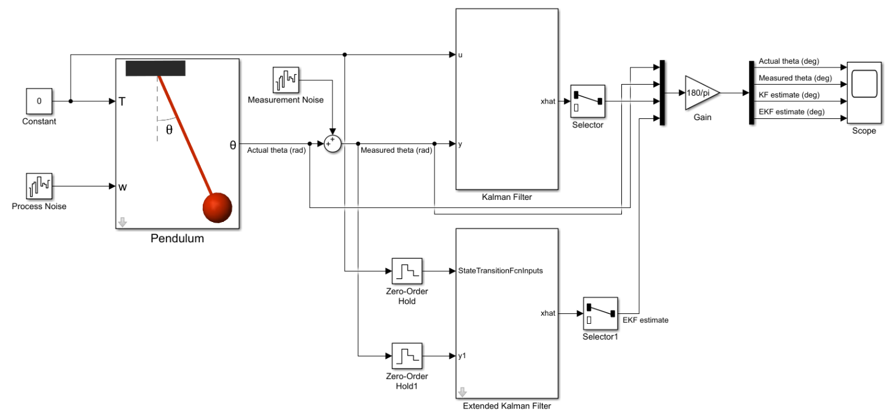
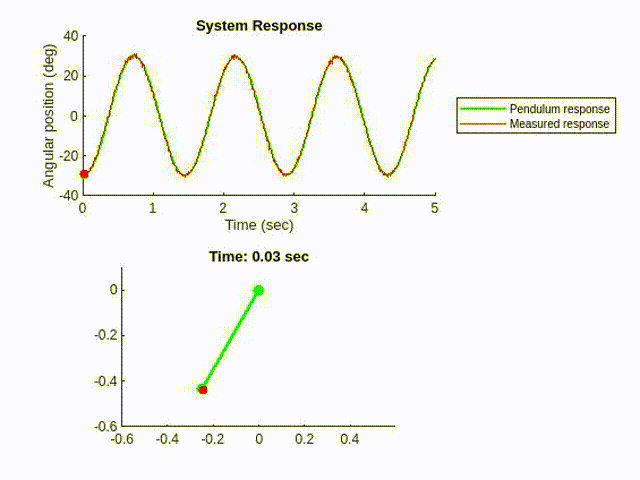
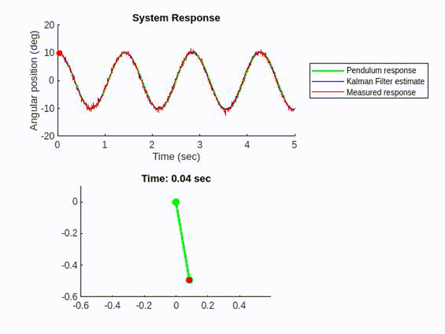
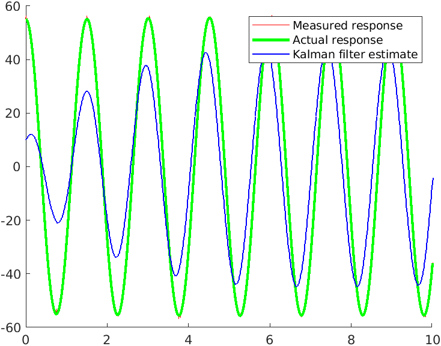
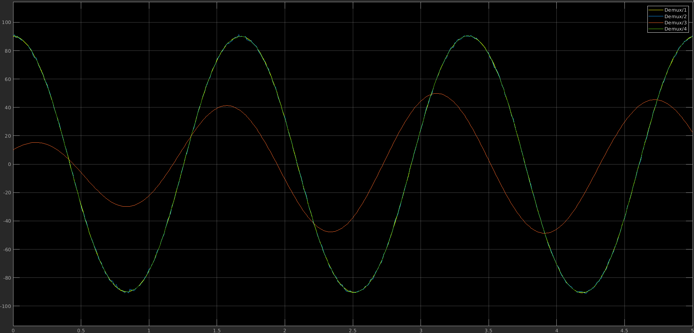
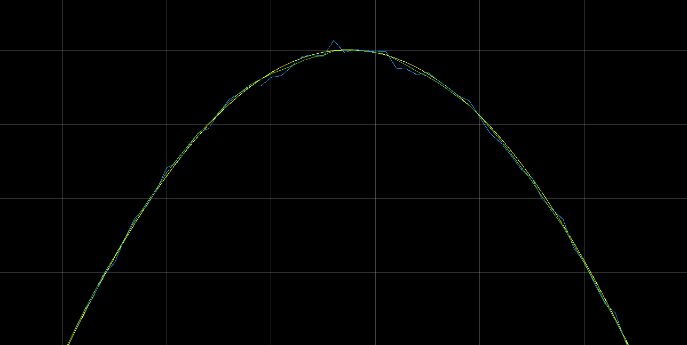

# _Kalman Filter_

Kalman Filter is widely used in sensor fusion and estimation topic.

In this project, I followed the [MATLAB Tech Talks tutorials](https://youtube.com/playlist?list=PLn8PRpmsu08pzi6EMiYnR-076Mh-q3tWr) to implement Kalman Filter and EKF in the MATLAB to estimate the motion of a pendulum.

The whole system is shown as below:

If the pendulum swings at small angle and the input torque is zero, the system can be approximately linear. Also, there are noise exist in both processing and measurement.

We could implement a Kalman filter using the model and the measurement input, to estimate the pendulum motion in a less noisy way.

However, as the initial angle of the pendulum increases to 55°, the linear Kalman Filter would start to lose accuracy.

To address the nonlinearity in the system, we could use Extended-Kalman Filter to linearize the system in place.

Demux 1 is the actual response, Demux 2 is the raw measured data (tampered by noise), Demux 3 is the estimate of the linear Kalman Filter, and Demux 4 is the result from the Extended-Kalman Filter.

Let's take a closer look.

The green estimate from the EKF is closer to the actual response (Yellow) than the measurement (Blue) does. Well done!

In the tutorial, we also tested the effect of filter's initial estimate and the filter's noise estimate. After the tutorial, I have a better understanding toward Kalman Filter, including the pros and cons of Kalman Filter, EKF, and Unscented Kalman filter.
