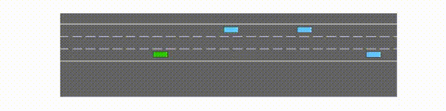

# _OpenAI Gym_

OpenAI [Gym](https://github.com/openai/gym) is an open source Python library providing environment for reinforcement learning algorithm. It will gradually transfer to [Gymnasium](https://github.com/Farama-Foundation/Gymnasium) library, I will try the Gymnasium in the future.

[Stable Baseline3](https://github.com/DLR-RM/stable-baselines3) is a set of reliable implementations of reinforcement learning algorithms in PyTorch. To support Gym version >= 0.26, you will need the pull request [here](https://github.com/DLR-RM/stable-baselines3/pull/780).

In this project, I followed the [tutorial](https://youtube.com/playlist?list=PL0sla3wvhSnblecvfPdyQXBJKGFeBxEkZ) to implement DQN (Deep Reinforcement Learning) and DDPG (Deep Deterministic Policy Gradient) in different environment.

## highway-fast-v0

[Code](https://drive.google.com/file/d/1IhY5i8w3Cu1LJFWULOT_HyAW95JQb0Q1/view?usp=sharing)

The first task is on a highway environment, the car needs to avoid crashing into other cars by switching to different lanes smoothly.

If we let the car idle, it will crash.

After using DQN training for 50000 steps, the best model success rate is 0.84 out of 25 tests.

The learning curve and the evaluation result.

## PandaReach-v2

[Code](https://www.kaggle.com/code/b07611001/panda-robot-ddpg)

The second task is the localization of a Panda robot arm. Hindsight Experience Replay Buffer is added to help the robot learn sparse reward better.

Let's first move the arm using intuition.

After using DDPG training for 300000 steps, the final success rate is 0.97 out of 30 tests.

There are still vibration after reaching the goal, future work would focus on imposing speed limit or combine traditional control to improve the performance and increase safety.
